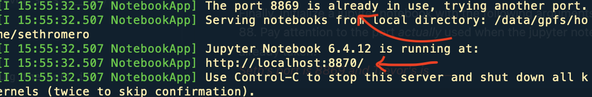

# General notes on pronghorn usage

## Where to work on pronghorn

For most of parchman lab work, things should be stored and worked on from:

    /data/gpfs/assoc/parchmanlab/

Files can be easily moved to or from here using scp or rsync.

    $ scp tparchman@pronghorn.rc.unr.edu:/data/gpfs/assoc/parchmanlab/parchman/*.pl .

    $ rsync -av muricata_fastqs tparchman@pronghorn.rc.unr.edu:/data/gpfs/assoc/parchmanlab/parchman/

# Containers or environments for managing software

Containers or environments must be used on pronghorn to install and run user specific software. Using such tools means that you can control your own portable environment, and that individual users do not have to install software more generally on the system. In the Parchman lab we have been using `anaconda` environments for this. Many others are using `singularity` or `apptainer` containers.

# Quick guide to installing and using `anaconda` environments on pronghorn

Using `anaconda` will allow you to install all of the programs you need on pronghorn, any other remote compute node, or your personal computer. Below are some commonly used and useful commands for installing, building environments, setting up channels, installing packages within environments, and copying and transporting environment containers. For excellent and more complete documentation see:

- [conda user guide](https://conda.io/projects/conda/en/latest/user-guide/index.html)

- [Anaconda documentation](https://docs.anaconda.com/)

## Installing an up-to-date Anaconda distribution

At https://repo.anaconda.com/archive/ you can find shell scripts that take care of conda installs for a variety of operating systems. For use on remote nodes or HPC clusters, you will want the linux version.

Below are simple steps to download and intall Anaconda, as I woudl suggest on pronghorn or other HPC. It will make the most sense to put `anaconda3` in your home directory, or perhaps another directory that serves as your main working directory. 
    
    $ cd /data/gpfs/assoc/parchmanlab/parchman/
	
    $ wget https://repo.anaconda.com/archive/Anaconda3-2022.10-Linux-x86_64.sh
    
    $ bash Anaconda3-2022.10-Linux-x86_64.sh

When done with the install, remove the shell script.

    $ rm Anaconda3-2022.10-Linux-x86_64.sh

To activate conda either log out/log back in or:

    $ source .bashrc

## Activating and deactivating environments

Conda has a default environment called base that includes a Python installation and some core system libraries and dependencies of Conda. It is a “best practice” to avoid installing additional packages into your base software environment. Instead, keep base as is, and create new environments with different names for specific uses.

To de-activate `base` conda:

    $ conda deactivate

To re-activate:

    $ conda activate

For both of the above, note that an environment name isnt needed for base.

## Create your main working environment and add some channels (environments other than base)

As you might wish to make additional environments with different packages and versions installed, it is worth thinking about what you name different environments and that you keep a clear understanding about installs and versions of different software. You can create, activate, and deactivate as many environments as you wish. `create` builds a new environment, `-n` specifies the name of that environment, and a current version of python is specified below.

    $ conda create -n py39 python=3.9

Channels are the hubs where packages are stored and serve a base for managing packages. Conda packages are downloaded from remote URLs to directories within the active environment. Adding connections to channels that host the type of packages you are most interested in installing can be done as below (and the below channels are recommended?):

    $ conda config --add channels bioconda
    $ conda config --add channels conda-forge
    $ conda config --add channels defaults
    $ conda config --add channels r

**NOTE:** You may need to modify `.condarc` in order to move conda-forge and bioconda to top of list, and to control channel collisions (when different package versions are hosted on different channels). You can read more about this type of issue and cirumventing problems [here](https://conda.io/projects/conda/en/latest/user-guide/tasks/manage-channels.html).


To activate a custom created environment (with the name created above), use:

    $ conda activate py39

To deactivate a currently active environment, use

    $ conda deactivate

Note, if you deactivate after activating your named environment, you can deactivate out of base using the same command.

It is not uncommon to have multiple conda environments, or even to forget which conda environments you have and/or their specific names. You can pull this information as below.

    $ conda info --envs
Or

    $ conda env list

## Conda package installs
In order to keep results and workflows reproducible and to make it easier to recreate your Conda environments on different machines, it is a good idea to clearly specify the version number for each package that you install into an environment. You can use `conda search` to look for specific packages by version. Most general use of this command:

    $ conda search bwa

This command will give you a full list of available versions for the `bwa` package


To figure out which channel and which version of a given software you want to install, it is generally best to google what you are looking for to see what is available and what channel you want to use.

Below will install the most current version of `bwa` and `vcftools`, and versions 1.10 of `samtools` and `bcftools` available from the `bioconda` channel. Note, that depending on workflows for reference mapping and variant calling (just as an example), specific versions of software might be key.

    $ conda install -c bioconda bwa
    $ conda install -c bioconda samtools=1.10
    $ conda install -c bioconda bcftools=1.10
    $ conda install -c bioconda vcftools


## Listing packages installed in an environment

To see a list of all packages installed in a specific environment:

If the environment is not activated:

    $ conda list -n myenv

If the environment is activated:

    $ conda list

    To see if a specific package is installed in an environment, in your terminal window or an Anaconda Prompt, run:

    conda list -n myenv scipy

## Uninstalling packages

Pretty simple and straightforward, just make sure you get the versions correct. Before running `uninstall`, you probably want to list installed packages as above.

Then, run uninstall with the package you want to use.

    $ conda uninstall packagename

## Building additional environments to keep dependencies clean

 You will likely want to build different conda environments for different software installs to keep dependencies clean. `Ipyrad` and `Ddocent` are examples of software in use where we have built separate environments with different dependencies. 

## Removing individual anaconda environments

To remove an environment, in your terminal window or an Anaconda Prompt, run:

    $ conda remove --name myenv --all

You may instead use conda env remove --name myenv.

To verify that the environment was removed, in your terminal window or an Anaconda Prompt, run:

    $ conda info --envs

## Fully removing anaconda installation

A full uninstall removes all traces of Anaconda and its programs with the `anaconda-clean` program. First, Install the anaconda-clean package, then run it.

    $ conda install anaconda-clean
    $ anaconda-clean --yes

Run the command by itself to remove all Anaconda-related files and directories with a confirmation prompt before deleting each one, or use the --yes argument to remove all those files and directories without being asked to confirm each one. Obviously, you want to think twice before doing this.

## Cloning environments for sharing and portability

You may want to share your environment among machines or collaborators to facilitate controlled replication of workflows. For quick environment cloning, with all packages and versions, you need to just produce an environment.yml file.

To export your current active environment:

    $ conda env export > environmentname.yml

To make a new conda environment from a shared or existing .yml file:

    $ conda env create -f environmentname.yml

For sharing environments in our lab, it is ideal to have the last name and date of environment author as part of the name. So, if Faske is going to share an environment with specific packages for GBS assembly/mapping and variant calling with Romero, a suggested name for a .yml file might be `GBS_bwasamtools_faske_12_22.yml`  
&nbsp;  
&nbsp;

# SLURM + HPC on pronghorn (needs updating)
Slurm is an open source, fault-tolerant, and highly scalable cluster management and job scheduling system for large and small Linux clusters. Slurm requires no kernel modifications for its operation and is relatively self-contained. As a cluster workload manager, Slurm has three key functions. First, it allocates exclusive and/or non-exclusive access to resources (compute nodes) to users for some duration of time so they can perform work. Second, it provides a framework for starting, executing, and monitoring work (normally a parallel job) on the set of allocated nodes. Finally, it arbitrates contention for resources by managing a queue of pending work.  Web resources: [Slurm website](https://slurm.schedmd.com/overview.html) and [quick cheat sheet](https://slurm.schedmd.com/pdfs/summary.pdf)

*IMPORTANT: always know how much memory and CPUs are avaiable for HPC in order to optimize analyses.* 

**The BioNRES node 68 has:**
* 192 GB physical memory. 
  * However, 24 GB are reserved for processes, which means there is roughly 5GB per core.
  * Allocation of memory is important for BioNRES becuase if a user is running a job with 16 cores but uses all the memory than the other 16 cores cannot be used by another user.
* 32 cores / 64 threads
  * We can use threading on BioNRES but can't use MPI because the account only allows use of one node.  This is dependant upon how you allocate resources. (i.e. `--ntasks` and `--cpus-per-task`).  In addition, `--hint=compute_bound` allows only one thread per cpu.  With this option enabled only 32 threads can be activated.  To run more than 32 threads don't include `--hint=compute_bound`.  The benefit of `--hint=compute_bound` is that it doesn't allow another job to use a thread on a CPU currently being used, which can slow an analysis.  Or at least that is what I understand from Sebastian.  

  **It is might be best to check allocation of resources with John Anderson before submitting a job.**

    *   Thread Example:
        ```
        #SBATCH --ntasks 1
        #SBATCH --cpus-per-task 32
        ```
    *   MPI Example:
         ```
        #SBATCH --ntasks 64
        #SBATCH --cpus-per-task 1
        ```
## Anatomy of a `slurm` wrapper

`slurm` submission files are bash scripts that:

* specify computational resources and time needed to run a batch of jobs
* load necessary software modules
* specify the commands to run, specifying input and output locations.

  
*Example of Slurm resource allocation submission file.*
```
#!/usr/bin/env bash
#SBATCH --account=cpu-s1-bionres-0
#SBATCH --partition=cpu-s1-bionres-0
#SBATCH --mail-type=FAIL
#SBATCH --mail-type=END
#SBATCH --mail-user=
#SBATCH --ntasks=1
#SBATCH --nodes=1
#SBATCH --cpus-per-task=32
#SBATCH --hint=compute_bound
#SBATCH --mem-per-cpu=2400
#SBATCH --job-name=
#SBATCH --output=
```
## executing `slurm` wrapper

    $ sbatch bwa_batch.sh

Common Slurm Commands
<!-- Tables -->
| Description  | Command |
| -------------------|-------------------|
| Run analysis | sbatch [file name] |
| Pulls job ids | squeue -u [account name] |
| Check status  info on cpus | scontrol show job -d [job id] |
| Kill job | scancel [job id] |
| Check CPU load and memory  | sinfo --nodes=cpu-[number] --Format="CPUsLoad,FreeMem"|


 
 ## running jobs through the queue on pronghorn using `slurm`
 
 ### different resources for parchman lab on pronghorn, both free and not so free (needs updating)
 

 ### monitoring your jobs
 To check status after job is started

    $ squeue -u tparchman

To check status with info on cpus

    $ scontrol show job -d <JOBID>

To kill job:

    $ scancel <JOBID>

 
 ## some things NOT to do on pronghorn (personal accounts of fuck-ups)

Text here  

&nbsp;  

# Establishing interactive jupyter notebooks on pronghorn login nodes (**Trevor style**)

*Before proceeding, make sure you have set up passwordless entry to pronghorn, ssh config, and appropriate conda enviornments...*  
&nbsp;    
The idea here is to combine two concepts:  
+ Running a headless jupyter notebook session off a pronghorn login node and forwarding that port to your local machine
+ Setting the notebook as long-running (via `screen`) for convenience of local access  
<span style="color:tomato"> *Is there a benefit to the second part aside from convenience? Since you're still running large jobs through slurm scripts on compute nodes (i.e. outside of jupyter and login node), you don't necessarily need the jupyter to be running outside of when you're interacting with it right? It's just nice to hop on from localhost without having to initialize the jupyter session each time...* </span>  
&nbsp;

## **Step 1:** Login to pronghorn and initialize a `screen` session  
Once created, screen sessions are essentially independently running terminals that can be attached to or detached from at your own convenience. Processes running inside the screen session will not be interrupted if your local terminal session closes or dies. In this case, we are running a headless (i.e. no GUI) jupyter notebook in the screen session that will run indefinitely and can be accessed whenever from our local machine.  

First, login to pronghorn:

    ssh pronghorn

When logging in to establish your screen session, note which login node you're on

    (base) [username@login-0 ~]$
    vs.
    (base) [username@login-1 ~]$

The screen session you create only exists on the login node you create it from.  It doesn't matter which node your session lives at, but it will be part of the address you direct your local machine to later.  

You can create a new screen session with the name `ipy` (to remind ourselves we are running a jupyter tunnel on this screen) with the command:

    screen -S ipy

<span style="color:red">**NOTE:**</span> Screen sessions are automatically named with their `processID` + `.session_name`.  The session_name can be anything you prefer.

For instance, in the example below the full screen session names would be `7405.name1` and `7507.another_name`. You need to use these full names with reattaching or otherwise modifying screen sessions. 


&nbsp;  
After establishing a new screen, you have an empty session without any processes running.  Before initializing your jupyter notebook, make sure you're comfortable detaching and reattaching to screen sessions.  The top of your terminal window can help indicate whether you're inside a screen session if you get lost.  

**The easiest way to detach from your current screen session is with <kbd>Ctrl</kbd> + <kbd>a</kbd> + <kbd>d</kbd>**  

You can view the names of all currently running screen sessions with:

    screen -ls

You can retach to any screen session with:

    screen -r sessionname
 
If needed (e.g. clean up purposes), you can terminate a screen session (you can be detached) with:

    screen -X -S sessionname quit  
&nbsp;

## **Step 2:** Initialize a headless jupyter notebook inside your screen session on pronghorn  
Re-attach to your screen session where you want to start your jupyter tunnel

    screen -r sessionname

Next, activate the conda environment that will allow you to run jupyter notebooks.  In my case that is called `py38`, but yours may look different.  Refer to above sections about managing and viewing available conda environments.

    conda activate py38

Finally, initialize a jupyter notebook with the following argument.  For the `XX` in `port`, choose any numbers besides 88.  Pay attention to the port *actually* used when the jupyter notebook is initialized as it may shift if your chosen one is already taken (see image below).

    jupyter notebook --no-browser --port=88XX --notebook-dir ~/



&nbsp;    
<span style="color:red"> **NOTE:**</span> Seth's port is 8869, Trevor's port is ____, and Tom's port is ____.  

In the arguments above, `--no-browser` allows to run jupyter headless and `--notebook-dir ~/` makes certain that the starting directory for jupyter is our home directory on pronghorn.  If you don't specify this, jupyter will initialize to whatever directory you are in when you call this command (which may be different if you've been moving around pronghorn).  

<span style="color:tomato"> *I realized Trevor runs the above two commands as a bash script inside the attached screen from the home directory.  However, `source activate` doesn't seem to identify my conda env directory correctly and `conda activate` is only functional (at least without modificaiton) at the command line.  I think doing it at the command line in this case will be more transparent for people learning and will more consistently work.  But either way works...* </span>  

You now have a headless jupyter notebook operating at all times on a pronghorn login node.  
&nbsp;  

## **Step 3:** Create a bash script to forward the jupyter port to your local machine

Finally, return to your home directory on your local machine. Once here, create a new bash script.  Here we are naming the script `jupyter1` to indicate that it will connect to a jupyter running on `login-1` node of pronghorn.

    touch jupyter1.sh

Open this script in the text editor of your choice:

    nano jupyter1.sh

For this script, we need to know **3** things:  
+ your pronghorn `username`
+ the `login` node where your jupyter is active (0 or 1) (`Y`)
+ the `port` that hosts your jupyter (`XXXX`)

Copy the following into this script with the appropriate variables changed to your specific values:

    #!/bin/bash/

    ssh username@login-Y.ph.rc.unr.edu -L 8888:localhost:XXXX

Save the file and exit (**<kbd>Ctrl</kbd> + <kbd>x</kbd>** followed by **<kbd>y</kbd>** and **<kbd>Enter</kbd>** if using `nano`)  

Now from the terminal, run this script

    bash jupyter1.sh

Open up a browser and enter `localhost:8888` into the URL field.  You should now see a jupyter directory starting from your home directory on pronghorn.  

**You can leave these jupyter notebooks at anytime and if you need to reconnect, the *only* thing you have to do is rerun your `jupyter1.sh` script**

## **SUCCESS!!**  
&nbsp;  

*May want to add reminder here or elsewhere that these notebooks operate on login nodes, **NOT** compute nodes.  So all the the same rules about submitting slurm scripts for big jobs apply...*