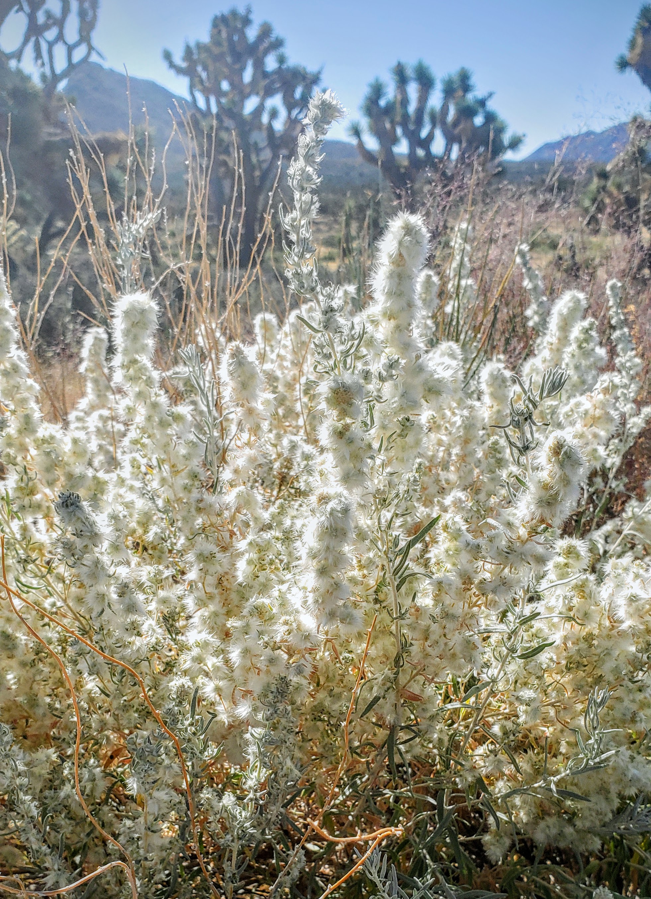

# Genotyping By Sequencing (GBS) - An Example Study
### Workflow and rationale for genotype inference from high throughput sequencing of reduced representation libraries (GBS, RADseq, ddRADseq, or whatever else people want to call it)

Methods described in this document are meant to be thorough and allow for user control at each step of the bioinformatic process. However, 'simpler' alternatives exist in the form of canned software packages and other streamlined computational workflows. These methods all rely on set thresholds for sequencing coverage depth per locus to call hard genotypes. This is highly problematic. Biggest cost of using these types of methods is throwing away much if not most of the data. Examples of such software/workflows include:

- [Stacks](https://catchenlab.life.illinois.edu/stacks/)
- [Ddocent](http://www.ddocent.com//)
- [ipyrad](https://ipyrad.readthedocs.io/en/master/)

See [Nielsen et al. 2011](./papers/Nielsen_etal_2011.pdf) and [Buerkle and Gompert 2013](./papers/Buerkle_Gompert_2013.pdf) for articulate thoughts about this.

# Focal Species (*Krascheninnikovia lanata*) Background & Sampling
 &emsp; &emsp;


&emsp; *Krascheninnikovia lanata* (winterfat) is a perennial shrub with a broad north/south distributional range spanning western Canada, U.S. and Mexico. The species is exclusive to North America and its current range is likely the result of southward expansion following two distinct migration events from eastern Mongolian lineages ~ 1.8 - 0.5 Mya.\
&emsp; The species is a halophyte (salt-tolerant) and is one of the only species outside of the *Atriplex* complex to co-dominate the salt desert shrublands of the Great Basin. It is a highly nutritious source of forage which is notable given that it is prone to replacement by the toxic exotic *Halogeton glomeratus* within disturbed habitats. The common name 'winterfat' is indicative of the persistence of green leaves throughout the winter season and late fall phenology.\
&emsp; Population sampling was a combined effort throughout 2021 - 2022 with Cathy Silliman doing collections for most of the populations in the west, central, and north Great Basin and Seth Romero gathering collections from the eastern Great Basin and Mojave. Anecdotally, many of the individuals in the north, central and eastern Great Basin were smaller in stature but part of broad near-monocultures that created consistent cover across broad areas. By contrast, many of the populations in the Mojave and southwest Great Basin were large individuals that occured in small islands or as sub-dominants with only a handful of individuals living in close proximity. The populations **DT** and **CL**, in particular, had nearly every individual sampled that could found at those locations.

### Sample organization
- Full information on DNAs for each individual sampled across natural distribution can be found in `XXXXXXXXXX`. This file also has the updated plate maps with specified IDs.

- **NOTE** DNA was extracted in December 2022 at AG Biotech. Plates in lab freezer need to be tranported to -80.

### Notes on library preparation

12/19-12/22: R/L and PCR for plates 1-6. Master mix in `KRLA_RFseq_mastermixcockatils.xlsx`.\
We generated 1 lane of S2 chemistry NovaSeq data at UTGSAF in March of 2023. 

# GBS Workflow Table of Contents

1) [INITIAL SEQUENCE PROCESSING](#1-initial-sequence-processing)\
    a. [Contaminant cleaning using tapioca](#1a-cleaning-contaminants)\
    b. [Parsing barcodes](#1b-barcode-parsing)\
    c. [Splitting fastqs](#1c-splitting-fastqs)
2) [DENOVO REFERENCE ASSEMBLY](#2-denovo-assembly-to-generate-a-consensus-reference-for-mapping-reads-prior-to-genotyping)\
    a. [Directory & file prep](#2a-directory--file-prep)\
    b. [Generating unique sequence files](#2b-generate-unique-sequence-files-for-each-individual)\
    c. [Sequence subsetting for alignment](#2c-subset-sequences-for-contig-alignment-and-assembly)
3) [READ MAPPING](#3-mapping-reads-from-all-individuals-to-reference-using-bwa)\
    a. [Directory & file prep]()
4) [CALLING VARIANTS]()
5) [FILTERING]()
6) [GENOTYPE PROBABILITIES]()

# 1. Initial Sequence Processing

### 1A. CLEANING CONTAMINANTS

Being executed on ponderosa using tapioca pipeline. Commands in two bash scripts (cleaning_bash_CADE.sh and cleaning_bash_SEGI.sh), executed as below (6/9/23). This was for one S2 NovaSeq lanes generated in late December 2022.

Decompress fastq file:

```sh
gunzip KRLA_S1_L001_R1_001.fastq.gz
```

Determine number of reads **before** cleaning:

```sh
nohup grep -c "^@" KRLA_S1_L001_R1_001.fastq > KRLA_number_of_rawreads.txt &
```
**RAW READS FOR KRLA:**  

To run cleaning_bash* tapioca wrapper, exit conda environment, load modules, and run bash scripts.

```sh
module load fqutils/0.4.1
```
```sh
module load bowtie2/2.2.5
```
```sh   
bash cleaning_bash_KRLA.sh &
```

After .clean.fastq has been produced, rm raw data:

```sh
rm -rf KRLA_S1_L001_R1_001.fastq &
```   

Raw data will stay stored in: /archive/parchman_lab/rawdata_to_backup/FRLA/

Number of reads **after** cleaning:

```sh
nohup grep -c "^@" KRLA.clean.fastq > FRLA1_clean_reads.txt &
``` 

### 1B. BARCODE PARSING

Be sure to deactivate conda environment before running the below steps. Barcode keyfiles are `/working/parchman/KRLA/KRLA_barcode_key.csv` 

Parsing KRLA library:

```sh
nohup perl parse_barcodes768.pl KRLA_barcode_key.csv KRLA.clean.fastq A00 &>/dev/null &
```

`NOTE`: the A00 object is the code that identifies the sequencer (first three characters after the @ in the fastq identifier).

    $ less parsereport_KRLA.clean.fastq
    Good mids count: 1571963061
    Bad mids count: 73508410
    Number of seqs with potential MSE adapter in seq: 321195
    Seqs that were too short after removing MSE and beyond: 428

### 1C. SPLITTING FASTQS


For KRLA, doing this in `/working/parchman/KRLA/splitfastqs`

**Make `ids` file**

```sh
cut -f 3 -d "," KRLA_barcode_key.csv | grep "_" > KRLA_ids_noheader.txt
```

**Split fastqs by individual**

```sh
nohup perl splitFastq_universal_regex.pl KRLA_ids_noheader.txt parsed_KRLA.clean.fastq &>/dev/null &
```

**gzip files (takes time)**  
*Can use `gzip -v` to set compression ratio (accepts values 1-9, 6 is default). The following steps (2a. - 2c.) depend on these files being gzipped. Compressing before copying to your working directory will also drastically speed up the file transfer time.*
    
```sh
nohup gzip *fastq &>/dev/null &
```

# 2. Denovo assembly to generate a consensus reference for mapping reads prior to genotyping

- when to use reference based
- when to not use reference based and why
- how to run reference based assembly
- how to run denovo assembly to generate artificial reference

#### Choices for clustering/assembly methods for this type of step:
- [LaCava et al. 2020](./papers/LaCava_etal_2020.pdf)

### 2A. DIRECTORY & FILE PREP


**Create directories for individual fastq files and assembly files**  
*Link to overall directory structure here for reference*

```sh
cd ~/me/KRLA/
```

```sh
mkdir fastq
```

```sh
mkdir assembly
```

**Move COMPRESSED fastq files to 'fastq' directory**  
*Make sure you zip/compress before moving to working directory. It will be much faster.*

```sh
cd fastq/
```

*`NOTE:` the directory in the following may need to be changed depending on where steps 1a. - 1c. are being done.* 

```sh
nohup cp /working/parchman/KRLA/splitfastqs/*.fastq.gz . &> /dev/null &
```

**Check  that correct number of individual fastq files have been moved**\
*Total KRLA individuals: **497***

```sh
ls *.fastq.gz -1 | wc -l
```

### 2B. GENERATE 'UNIQUE' SEQUENCE FILES FOR EACH INDIVIDUAL

This is the first of two steps aimed at improving the efficiency of running the `CD-HIT` alignment algorithm. By ignoring sequence repeats, we reduce the total number of sequences compared for alignment to <1% (in most datasets). `CD-HIT` could be run on all sequences across all individuals but it would take considerably longer and no information would be gained.

**Make list of individual IDs from all fastq files**
    
```sh
ls *.fastq.gz | sed -e 's/.fastq.gz//g' > nameList
```

**Set some variables that will be used to process sequences from individual fastqs in next step**

```sh
AWK1='BEGIN{P=1}{if(P==1||P==2){gsub(/^[@]/,">");print}; if(P==4)P=0; P++}'
AWK2='!/>/'
PERLT='while (<>) {chomp; $z{$_}++;} while(($k,$v) = each(%z)) {print "$v\t$k\n";}'
```

**Use variables to scan through fastq files and generate \*.uniq.seqs files for each individual (takes a few minutes)**  
*Insert more explanation here*

```sh
cat namelist | parallel --no-notice -j 8 "zcat {}.fastq | mawk '$AWK1' | mawk '$AWK2' | perl -e '$PERLT' > {}.uniq.seqs" &> /dev/null &
```

**Check progress**  
*Should eventually have same number of uniq.seqs files as fasta.gz files*\
*for KRLA: 497*

```sh
ls *.uniq.seqs -1 | wc -l
```

### 2C. SUBSET SEQUENCES FOR CONTIG ALIGNMENT AND ASSEMBLY

**Select a subset of all unique sequences to improve** 

```sh
bash /working/romero/scripts/selectContigs.sh 4 2 > ../assembly/k4.i2.seqs &
```


where `<k>` and `<i>` are your chosen parameters. Typically chosen values are somewhere between 2-10. The script called genContigSets.sh will also iteratively generate these files for the combination of k and i parameters across 2,4,6,8, and 10.


For reference here and to see what steps are being done to generate this subset of sequences, selectContigs.sh is copied below:    

```sh
#!/bin/bash

parallel --no-notice -j 16 mawk -v x=$1 \''$1 >= x'\' ::: *.uniq.seqs \
    | cut -f2 \
    | perl -e 'while (<>) {chomp; $z{$_}++;} while(($k,$v) = each(%z)) {print "$v\t$k\n";}' \
    | mawk -v x=$2 '$1 >= x' \
    | cut -f2 \
    | mawk '{c= c + 1; print ">Contig_" c "\n" $1}' \
    | sed -e 's/NNNNNNNNNN/\t/g' \
    | cut -f1
```

The above will produce files that look like knin.seqs... explain.

**SETH** Add a description of the files in the 'assembly' directory we talked about, how or why you would choose one for 

```sh   
module load cd-hit/4.6
```

Run `cd-hit-est` for chosen clustering similarity threshold. Helpful documentation for cd-hit found [here](https://github.com/weizhongli/cdhit/wiki/3.-User's-Guide#user-content-CDHITEST).
    
Most basic running of cd-hit looks like 

```sh
nohup cd-hit-est -i <inputFile> -o <outputFile> -M 0 -T 0 -c 0.92 &>/dev/null &
```

+ `-M ` - maximum memory allowed, default is 800M
    + if on ponderosa, set to 0 (unlimited), not a limiting factor here, but check with `htop`
+ `-T` - maximum number of threads (effectively CPUs)
    + 0 is all available (32 on ponderosa)
    + if running multiple cd-hits in parallel, something like 16 might make sense? Just so the whole server isn't bogged down. Run times are still reasonable at 16
+ `-c` - clustering similarity (i.e. how similar sequences have to be to be joined into a contig)
    + Values to try might be 0.8-0.98
    + Note as c increases, you generate **more** contigs and the cd-hit process runs **faster**
+ `<inputFile>` is generated in previous step (something like *k4.i6.seqs*). If generating multiple assemblies for comparison, Seth uses a naming convention like *rf.4.6.90* where k=4, i=6, and c=0.9. This makes for some easy parsing of information for comparing/plotting changes in contig totals/information ratios as shown below.

Note that for a given `<outputFile>` name, **2** files are generated - 1 with no file suffix (contigs only in fasta format) and 1 with .clstr suffix (with information on within contig cluster similarity).

For reference, a cd-hit of c=0.9 typically takes 5-10 minutes over 32 CPUs, with lower c-values being slower, and higher being faster...

*Will add information later on a script that parallelizes multiple cd-hit assemblies for comparison...*

If generating multiple assemblies, we can summarize the information into a file (here called *assemblyComparison*) via

```sh
grep "^>" rf*[0-9] -c | awk -F"[:.]" '{print $2"\t"$3"\t"$4"\t"$5}' > assemblyComparison
```

*Will add some code and/or images of plots for these comparisons later*

# 3. Mapping reads from all individuals to reference using `bwa`

### 3A. DIRECTORY & FILE PREP

## III. Using bcftools to build cigar formatted mpileup

## IV. Estimating genotype likelihoods with SAMtools

## V. Filtering variants with VCFtools

## VI. Entropy
---
---
BELOW IS EXAMPLE OF TWO APPROACHES OF ALIGNING TO REFERENCE GENOME:
## Alignment to *T. cristinae* genome and variant calling.
New versions of software installed on ponderosa, with modules:
- bwa 0.7.17-r1188 (https://github.com/lh3/bwa/releases)
- bcftools 1.9 (under https://sourceforge.net/projects/samtools/files/samtools/1.9/)
- samtools 1.10 (under https://sourceforge.net/projects/samtools/files/samtools/1.10/)

## 1) Working with T. cristinae reference genome
located at:
    ponderosa:/working/parchman/tpodura/raw_ind_fastqs/
    
## 2) reference based assembly with `bwa 0.7.17-r1188`

`NOTE`: Moving forward with 598 individuals

Make index for `bwa`

    $ module load bwa/0.7.17-r1188
    $ bwa index -p cristinae -a bwtsw re_mod_map_timema_06Jun2016_RvNkF702.fasta &


`bwa` wrapper, runbwa_memTLP.pl, modified to run the `mem` algorithim (rather than aln and samse), and used bwa 0.7.17-r1188. Parameter settings are described within the wrapper, more info with `bwa mem`

    $ module load bwa/0.7.17-r1188
    $ perl runbwa_memTLP.pl  *fastq &

## 3) Sorting, indexing, and converting `sam` files to `bam`

Number of threads set in script, based on current server usage.

    $ module load samtools/1.10
    $ perl sam2bamV1.10.pl *.sam


Cleaning up the directory
    
    $ rm *.sam
    $ rm *.sai

## 4. Making pileup (bcf) and variant calling with `bcftools 1.9`
tpod_bams is a text file with all of the **sorted** bam files listed, one per line

Options used:

-C --adjust-MQ INT     adjust mapping quality; recommended:50, disable:0 [0]

-d --max-depth INT     max per-file depth; avoids excessive memory usage [250] 

-f --fasta-ref FILE    faidx indexed reference sequence file

-q --min-MQ INT        skip alignments with mapQ smaller than INT [0]

-Q --min-BQ INT        skip bases with baseQ/BAQ smaller than INT [13]

-I --skip-indels       do not perform indel calling

-b --bam-list FILE     list of input BAM filenames, one per line

-O --output-type TYPE  'b' compressed BCF; 'u' uncompressed BCF;
                          'z' compressed VCF; 'v' uncompressed VCF [v]
                          
-o --output FILE       write output to FILE [standard output]


    $ module load bcftools/1.9
    $ bcftools mpileup -C 50 -d 250 -f re_mod_map_timema_06Jun2016_RvNkF702.fasta -q 30 -Q 20 -I -b tpod_bams -O b -o tpod.bcf

## 5. Generation vcf file from bcf.
Options used:
-v --variants-only             output variant sites only

-c --consensus-caller          the original calling method (conflicts with -m)

-f --format-fields <list>      output format fields: GQ,GP (lowercase allowed) []
    
-p --pval-threshold <float>    variant if P(ref|D)<FLOAT with -c [0.5]
                                                         
-P --prior <float>         mutation rate (use bigger for greater sensitivity), use with -m [1.1e-3]
    
-O --output-type <b|u|z|v>     output type: 'b' compressed BCF; 'u' uncompressed BCF; 'z' compressed VCF; 'v' uncompressed VCF [v]

    $ module load bcftools/1.9
    $ bcftools call -v -c -f GQ -p 0.01 -P 0.001 -O v -o tpod.vcf tpod.bcf

Checking number of SNPs:
    
    $ module load vcftools/0.1.14
    $ vcftools --vcf tpod.vcf 

After filtering, kept 598 out of 598 Individuals
After filtering, kept 127722 out of a possible 127722 Sites

## 5. Filtering

Just doing some rough preliminary stuff here, need to consider how ZG recommends filtering based on what was done above, and how he has been doing things with Timema for mapping.

make id file for reheadering

    $ ls *fastq > fastqs.txt
    $ sed -s "s/.fastq//" fastqs.txt > Tpod_ids_col.txt

reheader vcf

    $ module load bcftools/1.9
    $ module load vcftools/0.1.14
    $ bcftools reheader -s Tpod_ids_col.txt tpod.vcf -o rehead_tpod.vcf

initial round of filtering (just getting a feeling of how filtering parameters might shape the dataset)

    $ vcftools --vcf rehead_tpod.vcf --out variants_maf5_miss5 --remove-filtered-all --maf 0.03 --max-missing 0.5 --recode --thin 100

After filtering, kept 598 out of 598 Individuals, 18640 out of a possible 127722 Sites

    $ vcftools --vcf rehead_tpod.vcf --out variants_maf3_miss5 --remove-filtered-all --maf 0.03 --max-missing 0.5 --recode --thin 100
	        

After filtering, kept 598 out of 598 Individuals, kept 19384 out of a possible 127722 Sites


## Due to missing 702.1 in *T. cristinae* genome, now trying alignment to *T. podura* consensus genome and variant calling.

## 5) Working with *T. podura* reference genome
located at:
    ponderosa:/working/parchman/tpodura/raw_ind_fastqs/Tpodura_consensus.fa
    
## 6) reference based assembly with `bwa 0.7.17-r1188`

`NOTE`: Moving forward with 598 individuals

Make index for `bwa`

    $ module load bwa/0.7.17-r1188
    $ bwa index -p Tpodura_consensus -a bwtsw Tpodura_consensus.fa &


`bwa` wrapper, runbwa_memTLP.pl, modified to run the `mem` algorithim (rather than aln and samse), and used bwa 0.7.17-r1188. Parameter settings are described within the wrapper, more info with `bwa mem`

    $ module load bwa/0.7.17-r1188
    $ perl runbwa_memTLP.pl  *fastq &

## 7) Sorting, indexing, and converting `sam` files to `bam`

Number of threads set in script, based on current server usage.

    $ module load samtools/1.10
    $ perl sam2bamV1.10.pl *.sam


Cleaning up the directory
    
    $ rm *.sam
    $ rm *.sai

## 8. Making pileup (bcf) and variant calling with `bcftools 1.9`
tpod_bams is a text file with all of the **sorted** bam files listed, one per line

Options used:

-C --adjust-MQ INT     adjust mapping quality; recommended:50, disable:0 [0]

-d --max-depth INT     max per-file depth; avoids excessive memory usage [250] 

-f --fasta-ref FILE    faidx indexed reference sequence file

-q --min-MQ INT        skip alignments with mapQ smaller than INT [0]

-Q --min-BQ INT        skip bases with baseQ/BAQ smaller than INT [13]

-I --skip-indels       do not perform indel calling

-b --bam-list FILE     list of input BAM filenames, one per line

-O --output-type TYPE  'b' compressed BCF; 'u' uncompressed BCF;
                          'z' compressed VCF; 'v' uncompressed VCF [v]
                          
-o --output FILE       write output to FILE [standard output]


    $ module load bcftools/1.9
    $ bcftools mpileup -C 50 -d 250 -f Tpodura_consensus.fa -q 30 -Q 20 -I -b tpod_bams -O b -o tpod.bcf

# Done to here.

## 9. Generation vcf file from bcf.
Options used:
-v --variants-only             output variant sites only

-c --consensus-caller          the original calling method (conflicts with -m)

-f --format-fields <list>      output format fields: GQ,GP (lowercase allowed) []
    
-p --pval-threshold <float>    variant if P(ref|D)<FLOAT with -c [0.5]
                                                         
-P --prior <float>         mutation rate (use bigger for greater sensitivity), use with -m [1.1e-3]
    
-O --output-type <b|u|z|v>     output type: 'b' compressed BCF; 'u' uncompressed BCF; 'z' compressed VCF; 'v' uncompressed VCF [v]

    $ module load bcftools/1.9
    $ bcftools call -v -c -f GQ -p 0.01 -P 0.001 -O v -o tpod.vcf tpod.bcf

Checking number of SNPs:
    
    $ module load vcftools/0.1.14
    $ vcftools --vcf tpod.vcf 

After filtering, kept 598 out of 598 Individuals
After filtering, kept 127722 out of a possible 127722 Sites

## 10. Filtering

Just doing some rough preliminary stuff here, need to consider how ZG recommends filtering based on what was done above, and how he has been doing things with Timema for mapping.

make id file for reheadering

    $ ls *fastq > fastqs.txt
    $ sed -s "s/.fastq//" fastqs.txt > Tpod_ids_col.txt

reheader vcf

    $ module load bcftools/1.9
    $ module load vcftools/0.1.14
    $ bcftools reheader -s Tpod_ids_col.txt tpod.vcf -o rehead_tpod.vcf

initial round of filtering (just getting a feeling of how filtering parameters might shape the dataset)

    $ vcftools --vcf rehead_tpod.vcf --out variants_maf5_miss5 --remove-filtered-all --maf 0.03 --max-missing 0.5 --recode --thin 100

After filtering, kept 598 out of 598 Individuals, 18640 out of a possible 127722 Sites

    $ vcftools --vcf rehead_tpod.vcf --out variants_maf3_miss5 --remove-filtered-all --maf 0.03 --max-missing 0.5 --recode --thin 100
	        

After filtering, kept 598 out of 598 Individuals, kept 19384 out of a possible 127722 Sites

### Appendix 1: Reference of useful commands (as far as what Parchman lab people like)
Just an unorganized list for now, will clean up later...

+ `parallel` - easiest way to run jobs in parallel across CPUs. See [GNU Parallel tutorial](https://www.gnu.org/software/parallel/parallel_tutorial.html)
    + `-j` - max jobs to run in parallel
    + `--no-notice` - eliminates excessive notices printing to shell when running jobs
    + `:::` - followed by list of input files to process
+ `nohup <command> &> /dev/null &` - a way to run a longer background process that won't be interupted
    + `nohup` - keeps process running even if shell or terminal is exited (i.e. long jobs don't get terminated)
    + `&` - process is put in background (have access to shell while process is running)
    +  `/dev/null` - essentially a black hole to direct st. output from nohup into assuming you've already captured the output of interest
    + can do similar things with `screen` but `nohup` is simpler and enough for most of the use cases here
+ `time <command>` - prints the time a process takes after it completes
    + will generate 3 different times, but "real" is what you're usually interested in
    + useful for testing pararmeters of parallelization and getting idea of how long different tasks in pipeline take
+ `du -sch <files/dir/etc.> | tail -n 1` - way to see how much disk space a set of files is using, useful if a lot of temporary/intermediate files are being generated
+ `htop` - monitor status of jobs and CPU usage (just google for details)
